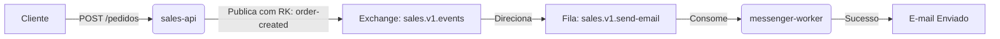

# 📦 Sistema de Pedidos & Notificação com RabbitMQ

Este repositório contém um ecossistema completo de microsserviços utilizando **Spring Boot** e **RabbitMQ** para demonstrar uma arquitetura orientada a eventos de nível profissional, desacoplando o fluxo de criação de pedidos do envio de e-mails.

## 🚀 Arquitetura e Fluxo

O projeto é estruturado como um monorepo dividido em duas aplicações independentes:

1. **[sales-api](./sales-api) (Producer):** Recebe a requisição de um novo pedido, processa a regra de negócio e publica um evento JSON na Exchange principal.
2. **[messenger-worker](./messenger-worker) (Consumer):** Consome os eventos da fila de forma assíncrona e processa o envio de e-mails fictícios de confirmação.

### 📐 Topologia do RabbitMQ Configurada

*   **Exchange Principal:** `sales.v1.events` (Topic)
*   **Fila de Destino:** `sales.v1.send-email`
*   **Routing Key:** `order-created`



## 🛡️ Resiliência, Tolerância a Falhas e DLX

O **messenger-worker** utiliza estratégias avançadas de resiliência industrial para garantir a integridade dos dados e proteção do Broker:

*   **Retry Automático:** Em caso de falhas intermitentes (ex: instabilidade na API de e-mail), o consumidor realiza até **3 tentativas** automáticas.
*   **Exponential Backoff:** O intervalo entre as tentativas aumenta exponencialmente (`multiplier: 2.0`), iniciando em **3 segundos** e limitando-se ao teto de **10 segundos** para evitar sobrecarga.
*   **Dead Letter Exchange (DLX):** Configurado com `default-requeue-rejected: false`. Se a mensagem esgotar as 3 tentativas de processamento, ela **não** retorna para a fila original (evitando loops infinitos). Ela é encaminhada para uma **DLX** de tratamento de erros para auditoria posterior.

## 📁 Estrutura do Repositório

*   `/sales-api`: API REST responsável pela criação de pedidos e publicação de eventos.
*   `/messenger-worker`: Worker responsável pelo consumo da fila e disparo de notificações.

## 📋 Pré-requisitos e Instalação Local

Você precisará instalar e rodar os serviços de infraestrutura diretamente na sua máquina:

### 1. Banco de Dados (PostgreSQL)
1. Instale o PostgreSQL e crie o banco de dados via terminal ou pgAdmin:
   ```sql
   CREATE DATABASE sales;
   ```
2. Certifique-se de que a senha do usuário `postgres` confere com a configurada nos projetos (`91696192`).

### 2. Mensageria (RabbitMQ)
1. Instale o Erlang e o servidor do RabbitMQ.
2. Certifique-se de que o serviço está ativo e rodando na porta padrão `5672`.

## ⚙️ Como Executar os Projetos

1. Clone este repositório unificado:
   ```bash
   git clone github.com
   cd sales-event-architecture
   ```
2. Certifique-se de que o PostgreSQL e o RabbitMQ locais estão online.
3. Abra e execute o projeto **sales-api** (porta padrão: `8080`).
4. Abra e execute o projeto **messenger-worker** (porta padrão: `8081`).

---
Desenvolvido como demonstração de padrões de microsserviços, desacoplamento e resiliência computacional.
